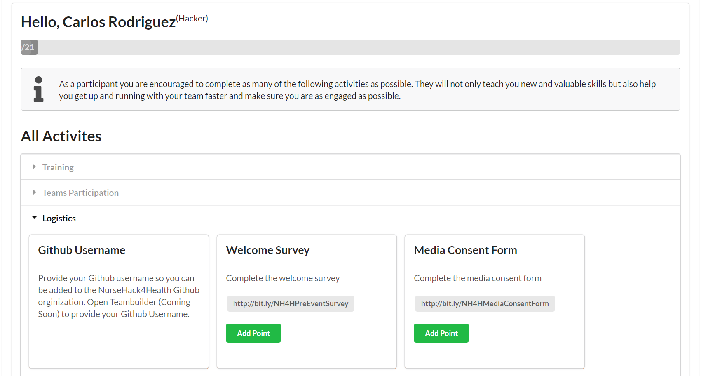
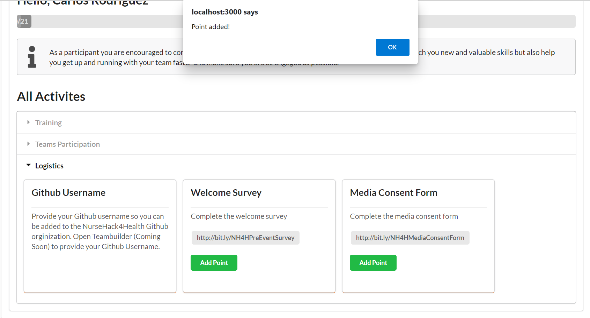

<<<<<<< HEAD
# Introduction 
TODO: Give a short introduction of your project. Let this section explain the objectives or the motivation behind this project. 

# Getting Started
TODO: Guide users through getting your code up and running on their own system. In this section you can talk about:
1.	Installation process
2.	Software dependencies
3.	Latest releases
4.	API references

# Build and Test
**Why?**
The purpose of this app is to track your participation in this hackathon. By tracking your progress through the app, you become aware of the various activities there are available to you throughout the event. Additionally, through your awareness, you become more engaged in all the components of the hackathon that are available to you as a participant.

All activities are categorized as training, team’s participation, and logistics. Across each respective category, these activities included will help educate you, collaborate with your team, and remain engaged with the event.

The bar on the top will start at 0/21. In other words, zero of the 21 activities have been completed. As each task is completed, the bar will advance until all activities are completed. 

Below is an example of completing two activities under the logistics category.

The two activities are the “Welcome Survey” and “Media Consent Form”. To complete these two activities, you are redirected to a separate page when you click each link. 

Upon completion of the survey and form, you return to the Gamification app. By simply clicking “Add Point”, your progress will be tracked on the bar. 

You are now at 2/21 activities completed.

Repeat this process for the remaining activities to achieve 21/21 activities completed.

# Ideas for Spring
* Maybe sort teams by least number of participants
* Add flag to indicate team is "full"
* Team create: check off what skills you're bringing to the team
* Team create:Team Description gets changed to problem pitch (keep away from solution and focus on problem)
* Team create: update problem types
* Team channel names maynot be autocreated
* Admin can associate a team to a channel
* Admin page / authorization 
* capture usage meterics for teams and users
* questions we want answers to: "how many searches are done?" "When were teams created?"" etc...

If you want to learn more about creating good readme files then refer the following [guidelines](https://docs.microsoft.com/en-us/azure/devops/repos/git/create-a-readme?view=azure-devops). You can also seek inspiration from the below readme files:
- [ASP.NET Core](https://github.com/aspnet/Home)
- [Visual Studio Code](https://github.com/Microsoft/vscode)
- [Chakra Core](https://github.com/Microsoft/ChakraCore)
=======
This project was bootstrapped with [Create React App](https://github.com/facebook/create-react-app).

## Available Scripts

In the project directory, you can run:

### `npm start`

Runs the app in the development mode. 
Open [http://localhost:3000](http://localhost:3000) to view it in the browser.

The page will reload if you make edits. 
You will also see any lint errors in the console.

### `npm test`

Launches the test runner in the interactive watch mode. 
See the section about [running tests](https://facebook.github.io/create-react-app/docs/running-tests) for more information.

### `npm run build`

Builds the app for production to the `build` folder. 
It correctly bundles React in production mode and optimizes the build for the best performance.

The build is minified and the filenames include the hashes. 
Your app is ready to be deployed!

See the section about [deployment](https://facebook.github.io/create-react-app/docs/deployment) for more information.

### `npm run eject`

**Note: this is a one-way operation. Once you `eject`, you can’t go back!**

If you aren’t satisfied with the build tool and configuration choices, you can `eject` at any time. This command will remove the single build dependency from your project.

Instead, it will copy all the configuration files and the transitive dependencies (webpack, Babel, ESLint, etc) right into your project so you have full control over them. All of the commands except `eject` will still work, but they will point to the copied scripts so you can tweak them. At this point you’re on your own.

You don’t have to ever use `eject`. The curated feature set is suitable for small and middle deployments, and you shouldn’t feel obligated to use this feature. However we understand that this tool wouldn’t be useful if you couldn’t customize it when you are ready for it.

## Learn More

You can learn more in the [Create React App documentation](https://facebook.github.io/create-react-app/docs/getting-started).

To learn React, check out the [React documentation](https://reactjs.org/).

### Code Splitting

This section has moved here: https://facebook.github.io/create-react-app/docs/code-splitting

### Analyzing the Bundle Size

This section has moved here: https://facebook.github.io/create-react-app/docs/analyzing-the-bundle-size

### Making a Progressive Web App

This section has moved here: https://facebook.github.io/create-react-app/docs/making-a-progressive-web-app

### Advanced Configuration

This section has moved here: https://facebook.github.io/create-react-app/docs/advanced-configuration

### Deployment

This section has moved here: https://facebook.github.io/create-react-app/docs/deployment

### `npm run build` fails to minify

This section has moved here: https://facebook.github.io/create-react-app/docs/troubleshooting#npm-run-build-fails-to-minify
>>>>>>> r1remote/master
